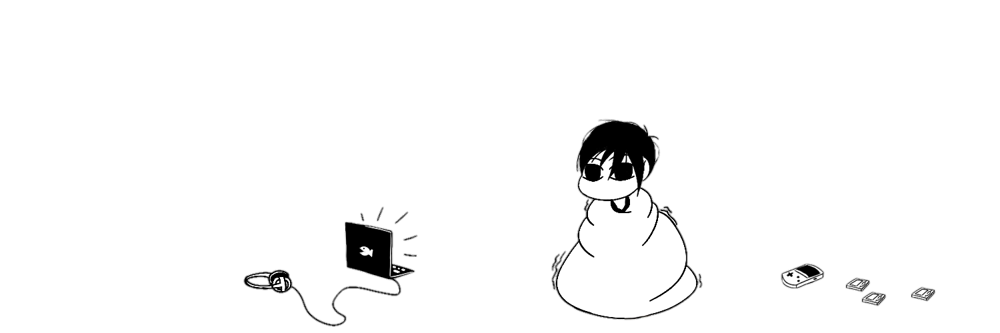

  
  

###

  

###

  

 

###

  
  

<h3 align="center">about</h3>

###

hi my name's <b>reyhan arief</b>. i currently studying informatics at bandung national institute of technology, rn i learning game n web development — still figuring things out as i go 

###

  
  

###

  
  

 

  
  

<h3 align="center">keep in touch :)</h3>

###

  
  

###

  
  

 

  
  

###

<h3 align="center">stuff i use</h3>

###

<h6 align="center"><strong>game development</strong></h6>

###

  
  
  
  
  
  
  
  
  

###

<h6 align="center"><strong>web development</strong></h6>

###

  
  
  
  
  
  
  
  
  
  
  

###

<h6 align="center"><strong>other</strong></h6>

###

  

###

  
  

